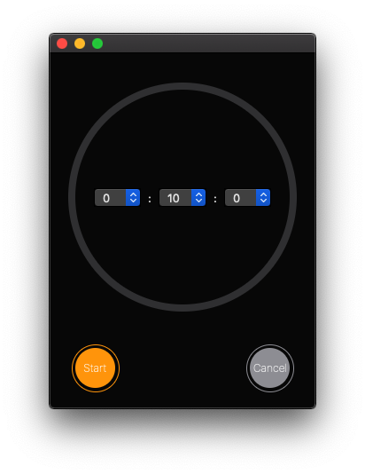
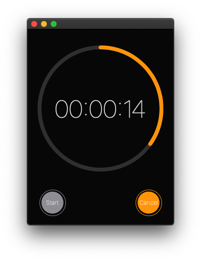

#  iOS-like timer

You can download [**and open Timer.app** ](https://github.com/levadev/swiftUI-timer-for-MacOS/archive/refs/heads/master.zip) or build your own version from source download [**and open timerApp.xcodeproj** ](https://github.com/levadev/swiftUI-timer-for-MacOS/archive/refs/heads/master.zip)

On the timer ends, you will hear a standard sound like on an iphone along with a screen flash.

**Target: MacOS 10.15**

## Start Screen
 

## In Progress

